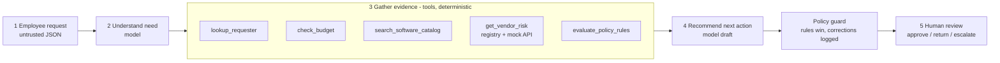
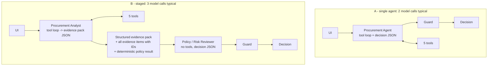

# Architecture and workflow

## Design principle in code

| Layer | Decides | Where |
|---|---|---|
| **AI** | What the requester needs, whether an existing tool already covers it (credible gap or not), whether the business purpose is too vague, which next action fits, what to ask the requester, and the wording of the recommendation | `src/agents.py`, `src/prompts.py` |
| **Code** | Approval thresholds, budget arithmetic, the 365-day review window against the policy reference date, registry vs. service conflicts, data-class triggers for Security / Privacy / Legal, required-field checks, prompt-injection scan, and the least-cautious action the rules allow | `src/policy_engine.py` |
| **Guard** | Merges the model's draft with the rules: approvals, flags and missing info are unioned; fact flags no tool raised are removed; actions less cautious than the rules are raised. It records every correction | `src/guard.py` |
| **Human** | Every approval, exception and override. The copilot only routes. The UI records the reviewer's decision with a mandatory comment for overrides | `app.py` (step 4), `runs/human_decisions.jsonl` |

## Workflow

## The two architectures

Both use the same five tools, the same policy engine, the same guard and the same output. Only the split of model work changes.

**Handoff format (B):** the reviewer receives four tagged blocks: `<request_data>` (untrusted), `<analyst_evidence_pack>` (need summary, overlap assessment, insufficient fields, key facts tied to evidence IDs, concerns), `<evidence_items>` (every tool finding with its ID) and `<deterministic_policy_result>` (required approvals with reasons, flags, missing fields, action floor). Schemas: `EVIDENCE_PACK_SCHEMA` and `DECISION_SCHEMA` in `src/prompts.py`. Both are enforced through structured outputs: a JSON-schema response on the tool-free call, plus a required-key check when the answer is parsed from a tool-turn reply.

## Tools

All five are deterministic code. The model chooses which ones to call and interprets what they return. It never computes a threshold, a date difference or a budget comparison itself.

| Tool | Data | Returns |
|---|---|---|
| `lookup_requester` | employees.csv | requester, manager, resolved Department Head (falls back up the reporting line when the department has no Director, e.g. Sales and Customer Success report to Go To Market) |
| `check_budget` | department_budgets.csv | within_budget / insufficient (with shortfall) / cost_unknown / no_budget_record |
| `search_software_catalog` | software_catalog.csv + purchase_history.csv | same-product / same-category / same-vendor / keyword matches; optional use-case query lets the model look across categories |
| `get_vendor_risk` | vendors.csv + `GET /vendor-risk/{vendor}` | both records, freshness against the reference date, conflicts, outage vs. not-found |
| `evaluate_policy_rules` | all of the above + policy | minimum approvals with reasons, risk flags, missing fields, least-cautious permissible action |

Every finding gets an evidence ID (`E1`, `E2`, ...). The model must cite IDs, and citations to IDs no tool produced are counted as grounding failures.

## Stop and escalation conditions

| Condition | Behaviour |
|---|---|
| Required field missing or business purpose too vague (after stripping injected text) | `request_clarification` plus questions for the requester. No approval routing |
| Security / Privacy / Legal trigger, budget shortfall, expired / conflicting / unverifiable vendor status, or injection detected | at least `route_for_review` |
| Vendor-risk API 5xx or unreachable | `vendor_risk_unavailable`. Security is required because the registry alone can be stale (SignalWatch). Data residency is unknown, so Privacy is required for sensitive data |
| Vendor-risk API 404 / vendor not in registry | treated as no assessment: Security, Legal (terms unknown) and Procurement onboarding |
| Model unavailable, refused, truncated, non-JSON, or tool loop exceeds `COPILOT_MAX_TURNS` | rules-only decision labelled `ai_assessment_unavailable`. Never more permissive than the rules |
| Model drops a requirement, asserts an unsupported fact or claims an approval | guard restores or removes it and logs a `GuardAdjustment` |
| Always | `human_review_required = true` (policy section 11) |

## Assumptions (policy interpretation)

1. **Reference date** is parsed from `procurement_policy.md` (2026-09-30), not taken from the machine clock. A review is current while `age <= 365` days.
2. **Thresholds** use the request's own annual amount. Boundaries are inclusive as written: $1,000 is Manager; $10,000 is DH + Procurement; Legal's new-vendor rule is `>= $10,000`.
3. **Budget**: the request must be `<=` available budget. A shortfall always adds Finance, even below the $10k tier.
4. **Overlap** = same product, or same category in the approved catalog. A same-vendor product in a different category (SignFlow Training Pack vs. SignFlow e-signature) is shown as evidence but is not flagged. Whether the overlap is a credible gap is decided by the model.
5. **Security data classes**: source code, production / cloud, confidential documents, employee or customer PII, credentials. Integrations also count (`Git` -> source code, `CRM` / `HelpDeskly` -> customer PII, `Production cloud account` -> production). Unrecognised data labels escalate instead of being treated as safe.
6. **Privacy**: PII, or sensitive data with a vendor that stores data outside the region, or sensitive data whose residency cannot be verified.
7. **Legal**: new vendor at or above $10k, terms not `Approved`, or cross-region processing of sensitive data (NeuralDesk + customer PII).
8. **Registry vs. service conflict** = status labels disagree (registry `Approved` vs. service `expired`) or review dates differ. A registry `Unknown` is treated as no claim, not as a conflict.
9. **New vendor** (registry status not `Approved`) adds Procurement for onboarding, even at the Manager tier.
10. **Department Head**: a Director or VP in the requester's department. Otherwise the first Director or VP up the reporting line.
11. **Unknown cost**: no financial tier can be computed, so Procurement triages and the request goes back for clarification. Injected "CFO-approved" claims are never carried into the approvals.

## Starter-pack issues found and fixed

| Issue | Effect | Fix |
|---|---|---|
| `data_access.py` used pandas, so blank cells became `NaN` | `NaN` is truthy and `str(NaN) == "nan"`, so "review date present?" checks pass on empty dates | stdlib `csv`, blanks become `None` |
| `vendor_client.py` used `raise_for_status()` | 404 (no record), 503 (outage) and connection errors were indistinguishable, but policy section 10 treats them differently | typed `VendorRiskNotFound` / `VendorRiskUnavailable` |
| Mock API called `unquote()` on an already-decoded path param and had no `:path` converter | names with `%` were mangled; names with `/` returned 404 at the router | single decode, `{vendor_name:path}` |
| `run_public_evals.py` assumed the mock API was already running | without `run_local.py`, every case reports a vendor outage and the eval measures the outage, not the system | `evals/mock_service.py` starts it on demand |
| `run_local.py` started Streamlit without `--server.headless` | a first-ever Streamlit run blocks on an interactive email prompt, so the one-command start hangs | headless + no usage stats |
| `.gitignore` ignored `evals/results_*.csv` | the brief requires committed, reproducible results | comparison results go to `evals/results/`, which is committed |
| Registry row for SignalWatch says `Approved` with a 2025-07-01 review | stale: it expired on 2026-07-01 and the service says `expired` | surfaced as `vendor_review_expired` + `conflicting_vendor_evidence` |
| `Go To Market` department (E007) has no budget row | Sales / CS department-head lookup needs the reporting line | reporting-line fallback |

## What I deliberately did not build

- A retrieval or vector store over the policy. The policy is about 1.2k tokens, so it goes into the prompt whole.
- More than two agents, an LLM-as-judge, or self-reflection loops. The brief rewards the simplest defensible system.
- Purchasing, budget writes or approval actions. The copilot cannot change any state except appending a human's decision to a local log.
- Authentication and multi-user persistence for the UI. It is a local MVP.
